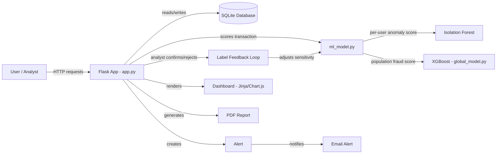

# Vaultic — Real-Time Fraud Detection System

A Flask-based fraud detection platform combining a population-level XGBoost model with a
per-user Isolation Forest to score transactions in real time, backed by an analyst feedback
loop that retrains on confirmed labels.

This is an FYP-1 submission. Several components proposed in the original project proposal
(Kafka, LSTM, React, Flutter, full OAuth2/AES-256 coverage) have been intentionally scoped
down to smaller, working substitutes for FYP-1, with a clear migration path documented for
FYP-2. This README states plainly what is implemented, what is partial, and what is deferred.

---

## Architecture



**Flow summary:** a transaction submitted through the app is scored by two models — a
per-user Isolation Forest trained on that user's own history, and a global XGBoost model
trained offline on the IEEE-CIS dataset. The combined score determines whether an Alert is
created, at what severity, and whether an email notification fires. Analysts can confirm or
reject alerts through a feedback loop that adjusts the Isolation Forest's sensitivity
(`adaptive_contamination`) going forward.

---

## Project Layout

```
app.py                  Flask app (routes, auth, alerts, PDF report, JWT API)
models.py               SQLAlchemy models
ml_model.py             Per-user Isolation Forest scoring + feedback loop
global_model.py         Loads the XGBoost baseline for population-level scoring
stream_worker.py        In-process queue + worker thread for async scoring
utils.py                Email / SMS alert helpers
crypto_utils.py         Fernet encryption for device_id
generate_fake_transactions.py
templates/  static/     Jinja templates and CSS
models_store/           xgboost_baseline.json + feature metadata (per-user models are generated)
instance/               SQLite database (generated)
tests/                  pytest suite
ml/                     Offline pipeline: explore -> preprocess -> train -> export feature metadata
scripts/                One-off DB migrations, table check, dashboard patch, load test
Data/                   IEEE-CIS CSVs (not in git)
```

Run everything from the project root, e.g. `python ml/train_model.py` or
`python scripts/check_tables.py`, since the scripts use paths relative to it.

The `Data/` CSVs are not committed. `train_transaction.csv` and `train_identity.csv` come from
the IEEE-CIS Fraud Detection dataset on Kaggle; `python ml/preprocess_data.py` regenerates the
`X_train`/`X_test`/`y_train`/`y_test` splits from them.

---

## Setup Instructions

1. **Clone the repository and create a virtual environment (Python 3.11):**
   ```powershell
   py -3.11 -m venv .venv
   .\.venv\Scripts\activate
   ```

2. **Install dependencies:**
   ```powershell
   pip install -r requirements.txt
   ```

3. **Configure environment variables** — copy `.env.example` to `.env` and fill in:
   ```
   FLASK_SECRET=your-secret-key-here
   SMTP_HOST=smtp.example.com
   SMTP_USER=your-email@example.com
   SMTP_PASS=your-app-password
   MAIL_DEV_MODE=1
   ```
   With `MAIL_DEV_MODE=1`, email alerts print to the console instead of sending — useful for
   local development and demos without a real mail server.

4. **Run the app:**
   ```powershell
   python app.py
   ```

5. **Run the test suite:**
   ```powershell
   python -m pytest tests/ -v
   ```
   Tests run against a temporary SQLite database created fresh per run and never touch your
   real `fraud_detection.db`.

---

## Implemented vs Deferred (FYP-1 Status)

| Component | Status | Notes |
|---|---|---|
| User auth (register/login/logout) | ✅ Implemented | Session-based, password hashing, covered by tests |
| Transaction submission & scoring | ✅ Implemented | Live route, covered by tests |
| Isolation Forest (per-user model) | ✅ Implemented | Trained live, used in production scoring path |
| XGBoost baseline model | ✅ Implemented (offline) | Trained on IEEE-CIS dataset with real metrics; integration into live ensemble scoring is **in progress** |
| Ensemble scoring (XGBoost + Isolation Forest) | ⏳ In progress | Design finalized (Phase 1 of roadmap); wiring into `ml_model.py` not yet complete |
| Severity scoring (Low/Med/High) | ✅ Implemented | Covered by tests |
| Alert creation & blocking logic | ✅ Implemented | Pending alerts block new transactions; covered by tests |
| Analyst feedback loop | ✅ Implemented | Confirmed labels feed back into `adaptive_contamination` |
| Email alerts | ✅ Implemented | Dev-mode fallback when SMTP not configured |
| SMS alerts (Twilio) | ⏳ Planned (FYP-1) | Not yet started |
| Firebase push notifications | ❌ Deferred to FYP-2 | Requires frontend service worker; out of scope for current server-rendered stack |
| Dashboard (charts, trends) | ⚠️ Partial | Basic transaction chart exists; Chart.js trend graphs planned |
| PDF report export | ✅ Implemented | `/dashboard/report.pdf` route, covered by tests |
| Case management (filter by status/severity) | ⏳ Planned (FYP-1) | Not yet started |
| Async transaction pipeline | ❌ Deferred to FYP-2 | Kafka replaced by proposed in-process `queue.Queue` + worker thread substitute (see roadmap); not yet implemented |
| Customer self-service portal (disputes, freeze) | ❌ Deferred to FYP-2 | Flutter app out of scope; minimal Flask routes (`/my_alerts`, `/dispute`, `/account/freeze`) planned as FYP-1 MVP |
| JWT-protected API endpoint | ❌ Deferred to FYP-2 | Session-based auth used throughout current app |
| Field-level encryption at rest | ❌ Deferred to FYP-2 | Planned: Fernet encryption on `device_id` |
| Automated test suite | ✅ Implemented | 15 tests covering auth, transactions, alerts, PDF export, scoring logic — all passing |
| Load/throughput testing | ⏳ Planned (FYP-1) | Simple `time.time()`-based script planned; no verified throughput number yet |

**Legend:** ✅ Implemented and verified · ⚠️ Partially implemented · ⏳ Planned for FYP-1, not yet started · ❌ Explicitly deferred to FYP-2

---

## Known Limitations

- The XGBoost model is trained on the IEEE-CIS dataset, which includes card/address/email
  features not present in this app's live transaction schema. Any future ensemble integration
  will use a reduced feature set mapped from available fields (`amount`, `tx_type`,
  `device_id`, `timestamp`), which is an approximation and is documented as such wherever it
  is used.
- `scikit-learn` version used to train the saved model artifacts should match the version
  pinned in `requirements.txt` — mismatches will raise `InconsistentVersionWarning` and may
  produce unreliable predictions. Verify with `pip show scikit-learn` in the training
  environment before final submission.

---

## Tech Stack

- **Backend:** Flask, Flask-SQLAlchemy, Flask-WTF (CSRF)
- **ML:** scikit-learn (Isolation Forest), XGBoost, pandas, numpy
- **Database:** SQLite
- **Frontend:** Jinja2 server-rendered templates
- **Testing:** pytest
- **PDF generation:** WeasyPrint (planned integration for dashboard reports)

---

## Project Roadmap

For the full phased plan (including SMS integration, async pipeline substitute, dashboard
enhancements, customer portal MVP, and security hardening), see `roadmap_to_40_percent.md`.
That file is not currently in the project and needs to be restored or rewritten.
